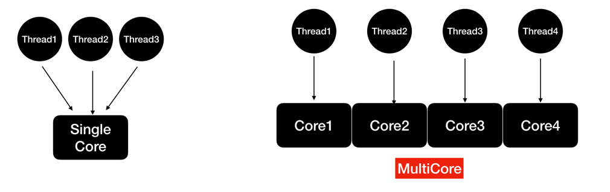

# Лекция 11.06.2024. Java Concurrency in Practice

## Многопоточность и параллелизм

Многопоточность (concurrency) - это состояние, когда по крайней мере два потока выполняют работу. 
Более обобщенная форма параллелизма, которая может включать нарезку времени (time slicing ) на одном CPU.

Параллелизм: Условие, возникающее при одновременном выполнении как минимум двух потоков. Например, на многоядерном CPU.
В Java параллелизм достигается с помощью потоков (threads)

## Как развивалась эта концепция в Java

| Java 1 1996 | Java 5 2004                                                   | Java 7 2011      | Java 8 2014                                    | Java 9 2017 | Java 19 2022                |
| -------------- |------------------------------------------------------------------|---------------------| ------------------------------------------------- | -------------- | ------------------------------ |
| Threads        | ThreadPool, ExecutorService, Futures, ConcurrentCollections etc. | Fork/Join Framework | Parallel Streams (Streams API) CompletableFutures | Flow API       | Virtual Threads (Project Loom) |

В реальной жизни потоки должны взаимодействовать друг с другом (например, через Shared Objects или Messaging Queues)

Возможные проблемы такого взаимодействия: 
- Race Condition
- Deadlock

Как бороться? Есть разные инструменты синхронизации потоков:
- Synchronized Statements/Methods 
- Reentrant Locks, Semaphores
- Concurrent Collections
- Conditional Objects

Зачем их столько и разных? Почему нельзя всегда использовать один?

Некоторые просты, универсальны и встроены в язык (**synchronized**), другие - более эффективны/производительны, но подходят
только для одного сценария использования или класса задач. Например, **ReentrantReadWriteLock** (эта структура полезна, 
когда у нас есть данные, которые могут читаться несколькими потоками одновременно, но изменяться только одним).

Базовые примитивы многопоточного программирования: мьютексы, мониторы, семафоры.

## Java Memory Model (JSR-133: Java Memory Model and Thread Specification)

Спецификация JMM определяет, как потоки взаимодействуют через память. Она описывает формальные правила и гарантии, 
которые нужно соблюдать при организации доступа к переменным в многопоточных приложениях. 
Одним из ключевых понятий в JMM является отношение “happens-before”, которое помогает понять, когда одна операция 
**_видна_** и **_упорядочена_** относительно другой.

Видимость (visibility): гарантирует, что изменения в одной переменной, выполненные одним потоком, станут видимы для других потоков.
Упорядоченность (ordering): определяет порядок, в котором выполняются операции в различных потоках и каким образом они 
могут наблюдаться.

“Happens-before”: ключевое отношение в JMM. Когда одна операция “happens-before” (происходит до) другой, это означает, 
что результат первой операции будет виден и упорядочен относительно второй операции. 
Если операция A происходит до операции B, то любые изменения, совершенные в A, будут видны и далее применимы в B.

Примеры гарантий “happens-before”:

Правило монитора: Разблокировка монитора (lock) потоком происходит до последующей блокировки (unlock) того же монитора другим потоком.

Правило volatile переменных: Запись в volatile переменную происходит до последующего чтения этой переменной другим потоком.

Правило потоков: Запуск нового потока через вызов Thread.start() происходит до выполнения любого кода в этом потоке.

Правило окончания потока: Завершение потока через вызов Thread.join() происходит до возврата из метода join() этим потоком.

## Современные инструменты многопоточности в Java

### ExecutorService и пулы потоков

1. Управление потоками:
- Простота создания: позволяет легко создавать и управлять пулами потоков, освобождая разработчика от необходимости вручную создавать и управлять потоками.
- Повторное использование: пулы потоков повторно используют созданные потоки для новых задач, что снижает накладные расходы на создание и уничтожение потоков.
2. Обработка задач:
- Очереди задач: задачи могут добавляться в очередь и выполняться, когда станет доступен поток, что улучшает управление нагрузкой.
- Планирование задач: встроенная возможность планировать выполнение задач с задержкой или по расписанию.
3. Управление завершением работы: весь пул потоков может быть корректно завершен при помощи методов shutdown() и shutdownNow(), обеспечивая завершение всех задач перед остановкой.
4. Оптимизация ресурсов: позволяет оптимально использовать системные ресурсы, благодаря контролю за количеством потоков и их использованием.
5. Четкий код: отделение логики выполнения задач от их планирования и управления потоками делает код более понятным и поддерживаемым.

### CompletableFuture

CompletableFuture — мощный инструмент, введенный в Java 8, значительно упрощает асинхронное программирование.

**Преимущества:**

Асинхронное выполнение: можно выполнять задачи в фоновом режиме, не блокируя основной поток. 
Композиция задач: можно легко комбинировать несколько асинхронных операций, создавать упорядоченные цепочки задач. 
Обработка исключений: CompletableFuture предоставляет методы для обработки исключений, возникающих в асинхронных задачах. 
Нет блокировок: Благодаря возможности выполнения задач в фоновом режиме, CompletableFuture позволяет избежать блокировок основного потока, что увеличивает производительность. 
Управление параллельностью: Предоставляет инструменты для ограничивания количества параллельных задач и управления их порядком выполнения. 
Синхронизация результатов: Легко синхронизировать результаты нескольких асинхронных операций.

**Сценарии использования:**

Выполнение HTTP-запросов: можно отправить несколько HTTP-запросов параллельно и обработать результаты после их завершения. 
Обработка данных: можно параллельно обрабатывать большие объемы данных. 
Работа с базами данных: Асинхронное выполнение запросов к базам данных для повышения отзывчивости приложения. 
Выполнение фоновых задач, например, загрузки данных из файлов или вычисления, без блокировки основного потока.

